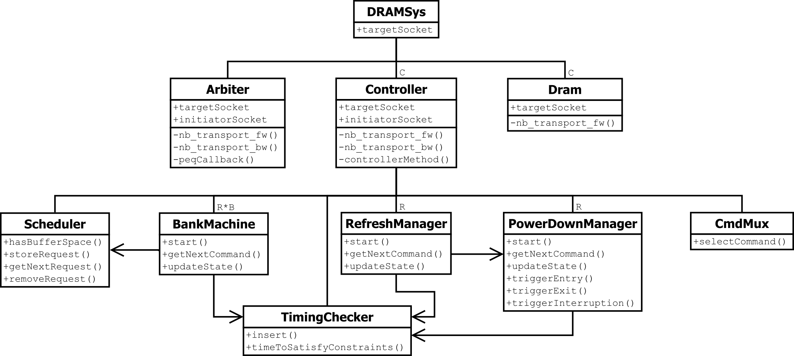
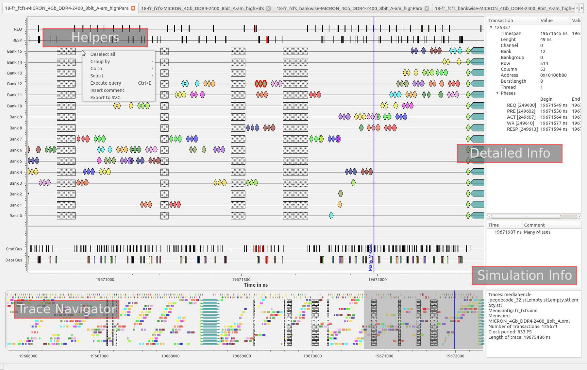

  

**DRAMSys4.0** is a flexible DRAM subsystem design space exploration framework based on SystemC TLM-2.0. It was developed at the [Microelectronic Systems Design Research Group](https://ems.eit.uni-kl.de/en/start/) and [Fraunhofer IESE](https://www.iese.fraunhofer.de/en.html).

\>> [Official Website](https://www.iese.fraunhofer.de/en/innovation_trends/autonomous-systems/memtonomy/DRAMSys.html) <<

## Disclaimer

This is the public read-only mirror of an internal DRAMSys repository. Pull requests will not be merged but the changes might be added internally and published with a future commit. Both repositories are synchronized from time to time.

The user DOES NOT get ANY WARRANTIES when using this tool. This software is released under the BSD 3-Clause License. By using this software, the user implicitly agrees to the licensing terms.

If you decide to use DRAMSys in your research please cite the papers [2] [3]. To cite the TLM methodology of DRAMSys use the paper [1].

## Key Features

- **standalone** simulator with trace players, **gem5**-coupled simulator and **TLM-AT-compliant library**
- support for **DDR3/4**, **LPDDR4**, **Wide I/O 1/2**, **GDDR5/5X/6** and **HBM1/2**
- support for **DDR5**, **LPDDR5** and **HBM3** under development (contact [Matthias Jung](mailto:matthias.jung@iese.fraunhofer.de) for more information) 
- automatic source code generation for new JEDEC standards [3] [9] from the domain-specific language DRAMml
- FIFO, FR-FCFS and FR-FCFS with read/write grouping scheduling policies
- open, closed, open adaptive and closed adaptive page policy [8]
- all-bank refresh, same-bank refresh and per-bank refresh with pulled-in and postponed refresh commands
- staggered power down [5]
- coupling to **DRAMPower** [4] and **3D-ICE** [8] for power and thermal simulation
- **Trace Analyzer** for visual and metric-based result analysis

## Architecture and Functionality

A UML diagram of the software architecture is presented below; different component implementations are left out for simplicity. More information about the architecture and functionality can be found in the papers [1] [2] [3] and in the introduction video on [Youtube](https://www.youtube.com/watch?v=8EkC3mYWpQY).



## Trace Analyzer Consulting and Custom-Tailored Modifications

To provide better analysis capabilities for DRAM subsystem design space exploration than the usual performance-related outputs to the console, DRAMSys offers the Trace Analyzer. 

All requests, responses and DRAM commands can be recorded in an SQLite trace database during a simulation and visualized with the tool afterwards. An evaluation of the trace databases can be performed with the powerful Python interface of the Trace Analyzer. Different metrics are described as SQL statements and formulas in Python, which can be customized or extended without recompilation.

The Trace Analyzer's main window is shown below.

If you are interested in the Trace Analyzer, if you need support with the setup of DRAMSys in a virtual platform of your company, or if you require custom modifications of the simulator please contact [Matthias Jung](mailto:matthias.jung@iese.fraunhofer.de).

 

## Basic Setup

Start using DRAMSys by cloning the repository.
Use the `--recursive` flag to initialize all submodules within the repository, namely **DRAMPower**, **SystemC**, **nlohmann JSON** and **SQLite Amalgamation**.

### Dependencies

DRAMSys requires a **C++17** compiler. The build process is based on **CMake** (minimum version **3.10**). Furthermore, the simulator is based on **SystemC**. SystemC is included as a submodule and will be build automatically with the project. If you want to use an external SystemC version, export the environment variables `SYSTEMC_HOME` (SystemC root directory) and `SYSTEMC_TARGET_ARCH` (e.g., linux64).

### Building DRAMSys

To build the standalone simulator for running memory trace files or a traffic generator, create a build folder in the project root directory, then run CMake and make:

```bash
$ cd DRAMSys
$ mkdir build
$ cd build
$ cmake ../DRAMSys/
$ make
```

If you plan to integrate DRAMSys into your own SystemC TLM-2.0 project you can build the DRAMSys library only:

```bash
$ cd DRAMSys
$ mkdir build
$ cd build
$ cmake ../DRAMSys/library/
$ make
```

To build DRAMSys on Windows 10 we recommend to use the **Windows Subsystem for Linux (WSL)**.

Information on how to couple DRAMSys with **gem5** can be found [here](DRAMSys/gem5/README.md). 

### Executing DRAMSys

From the build directory use the commands below to execute the DRAMSys standalone.

```bash
$ cd simulator
$ ./DRAMSys
```

The default base config file is *ddr3-example.json* located in *DRAMSys/library/resources/simulations*, the default resource folder for all nested config files is *DRAMSys/library/resources*.

To run DRAMSys with a specific base config file:

```bash
$ ./DRAMSys ../../DRAMSys/library/resources/simulations/ddr3-example.json
```

To run DRAMSys with a specific base config file and a resource folder somewhere else to the standard:

```bash
$ ./DRAMSys ../../DRAMSys/tests/example_ddr3/simulations/ddr3-example.json ../../DRAMSys/tests/example_ddr3/
```

### DRAMSys Configuration

The DRAMSys executable supports one argument, which is a JSON file that contains certain arguments and the name of nested configuration files for the desired simulation. Alternatively, the contents of nested configuration files can also be added directly to the top configuration file instead of the file name.

The JSON code below shows an example configuration:

```json
{
    "simulation": {
        "simulationid": "ddr3-example",
        "simconfig": "ddr3.json",
        "thermalconfig": "config.json",
        "memspec": "MICRON_1Gb_DDR3-1600_8bit_G.json",
        "addressmapping": "am_ddr3_8x1Gbx8_dimm_p1KB_brc.json",
        "mcconfig":"fifoStrict.json",
        "tracesetup": [
            {
                "clkMhz": 300,
                "name": "ddr3_example.stl",
                "addLengthConverter": true
            },
            {
                "clkMhz": 2000,
                "type": "generator",
                "name": "gen0",
                "numRequests": 2000,
                "rwRatio": 0.85,
                "addressDistribution": "random",
                "seed": 123456,
                "maxPendingReadRequests": 8,
                "maxPendingWriteRequests": 8,
                "minAddress": 16384,
                "maxAddress": 32767
            },
            {
                "clkMhz": 1000,
                "type": "hammer",
                "name": "ham0",
                "numRequests": 4000,
                "rowIncrement": 2097152
            }
        ]	
    }
}
```
Field Descriptions:
- "simulationid": simulation file identifier
- "simconfig": configuration file for the DRAMSys simulator
- "thermalconfig": thermal simulation configuration file
- "memspec": memory device configuration file
- "addressmapping": address mapping configuration file
- "mcconfig": memory controller configuration file
- "tracesetup": The trace setup is only used in standalone mode. In library mode or gem5 mode the trace setup is ignored. Each device should be added as a json object inside the "tracesetup" array. 

Each **trace setup** device configuration can be a **trace player** ("type": "player"), a **traffic generator** ("type": "generator") or a **row hammer generator** ("type": "hammer"). By not specifing the **type** parameter, the device will act as a **trace player**.
All device configurations must define a **clkMhz** (operation frequency of the **traffic initiator**) and a **name** (in case of a trace player this specifies the **trace file** to play; in case of a generator this field is only for identification purposes).
The optional parameter **addLengthConverter** adds a transaction length converter between initiator and DRAMSys. This unit divides a large transaction up into several smaller transactions with the maximum length of one DRAM burst access.
The **maxPendingReadRequests** and **maxPendingWriteRequests** parameters define the maximum number of outstanding read/write requests. The current implementation delays all memory accesses if one limit is reached. The default value (0) disables the limit.

A **traffic generator** can be configured to generate **numRequests** requests in total, of which the **rwRatio** field defines the probability of one request being a read request. The length of a request (in bytes) can be specified with the **dataLength** parameter. The **seed** parameter can be used to produce identical results for all simulations. **minAddress** and **maxAddress** specify the address range, by default the whole address range is used. The parameter **addressDistribution** can either be set to **random** or **sequential**. In case of **sequential** the additional **addressIncrement** field must be specified, defining the address increment after each request.

The **row hammer generator** is a special traffic generator that mimics a row hammer attack. It generates **numRequests** alternating read requests to two different addresses. The first address is 0x0, the second address is specified by the **rowIncrement** parameter and should decode to a different row in the same bank. Since only one outstanding request is allowed, the controller cannot perform any reordering, forcing a row switch (precharge and activate) for each access. That way the number of activations on the target rows are maximized.

Most configuration fields reference other JSON files which contain more specialized chunks of the configuration like a memory specification, an address mapping and a memory controller configuration.


#### Trace Files

A **trace file** is a prerecorded file containing memory transactions. Each memory transaction has a time stamp that tells the simulator when it shall happen, a transaction type (*read* or *write*) and a hexadecimal memory address. The optional length parameter (in bytes) allows sending transactions with a custom length that does not match the length of a single DRAM burst access. In this case a length converter has to be added. Write transactions also have to specify a data field when storage is enabled in DRAMSys.

There are two different kinds of trace files. They differ in their timing behavior and are distinguished by their file extension.

##### STL Traces (.stl)

The time stamp corresponds to the time the request is to be issued and it is given in cycles of the bus master device. Example: The device is an FPGA with a frequency of 200 MHz (clock period of 5 ns). If the time stamp is 10 the request is to be issued when time is 50 ns.

Syntax example:

```
# Comment lines begin with #
# cycle: [(length)] command hex-address [hex-data]
31: read 0x400140
33: read 0x400160
56: write 0x7fff8000 0x123456789abcdef...
81: (128) read 0x400180
```

##### Relative STL Traces (.rstl)

The time stamp corresponds to the time the request is to be issued relative to the end of the previous transaction. This results in a simulation in which the trace player is able to react to possible delays due to DRAM bottlenecks.

Syntax example:

```
# Comment lines begin with #
# cycle: [(length)] command hex-address [hex-data]
31: read 0x400140
2: (512) read 0x400160
23: write 0x7fff8000 0x123456789abcdef...
10: read 0x400180
```

##### Elastic Traces

More information about elastic traces can be found in the [gem5 readme](DRAMSys/gem5/README.md).

#### Trace Player

A trace player is equivalent to a bus master device (processor, FPGA, etc.). It reads an input trace file and translates each line into a new memory request. By adding a new device element into the trace setup section one can specify a new trace player, its operating frequency and its trace file.

#### Configuration File Sections

The main configuration file is divided into self-contained sections. Each of these sections refers to sub-configuration files. Below, the sub-configurations are listed and explained.

##### Simulator Configuration

The content of [ddr3.json](DRAMSys/library/resources/configs/simulator/ddr3.json) is presented below as an example.

```json
{
    "simconfig": {
        "SimulationName": "ddr3",
        "Debug": false,
        "DatabaseRecording": true,
        "PowerAnalysis": false,
        "EnableWindowing": false,
        "WindowSize": 1000,
        "ThermalSimulation": false,
        "SimulationProgressBar": true,
        "CheckTLM2Protocol": false,
        "ECCControllerMode": "Disabled",
        "UseMalloc": false,
        "AddressOffset": 0,
        "ErrorChipSeed": 42,
        "ErrorCSVFile": "",
        "StoreMode": "NoStorage"
    }
}
```

  - *SimulationName* (string)
    - Give the name of the simulation for distinguishing from other simulations.
  - *Debug* (boolean)
    - true: enables debug output on console (only supported by a debug build)
    - false: disables debug output
  - *DatabaseRecording* (boolean)
    - true: enables output database recording for the Trace Analyzer tool
    - false: disables output database recording
  - *PowerAnalysis* (boolean)
    - true: enables live power analysis with DRAMPower
    - false: disables power analysis
  - *EnableWindowing* (boolean)
    - true: enables temporal windowing
    - false: disables temporal windowing
  - *WindowSize* (unsigned int)
    - Size of the window in clock cycles used to evaluate average bandwidth and average power consumption
  - *ThermalSimulation* (boolean)
    - true: enables thermal simulation ([more information](#dramsys-with-thermal-simulation))
    - false: static temperature during simulation
  - *SimulationProgressBar* (boolean)
    - true: enables the simulation progress bar
    - false: disables the simulation progress bar
  - *CheckTLM2Protocol* (boolean)
    - true: enables the TLM-2.0 Protocol Checking
    - false: disables the TLM-2.0 Protocol Checking
  - *ECCControllerMode* (string)
    - "Disabled": No ECC controller is used
    - "Hamming": Enables an ECC Controller with classic SECDED implementation using Hamming Code
  - *UseMalloc* (boolean)
    - false: model storage using mmap() (DEFAULT)
    - true: allocate memory for modeling storage using malloc()
  - *AddressOffset* (unsigned int)
    - Address offset of the DRAM subsystem (required for the gem5 coupling).
  - *ErrorChipSeed* (unsigned int)
    - Seed to initialize the random error generator.
  - *ErrorCSVFile* (string)
    - CSV file with error injection information.
  - *StoreMode* (string)
    - "NoStorage": no storage
    - "Store": store data without error model
    - "ErrorModel": store data with error model [6]

##### Thermal Simulation

The thermal simulation configuration can be found [here](#thermal-simulation-configuration).


##### Memory Specification

A file with memory specifications. Timings and currents come from data sheets and measurements and usually do not change.  
The fields inside "mempowerspec" can be written directly as a **double** type, "memoryId" and "memoryType" are **string**, all other fields are **unsigned int**.

##### Address Mapping

DRAMSys uses the **ConGen** [7] format for address mappings. It provides bit-wise granularity. It also provides the possibility to XOR address bits in order to map page misses to different banks and reduce latencies. 

Used fields:  
- "XOR": Defines an XOR connection of a "FIRST" and a "SECOND" bit
- "BYTE_BIT": Address bits that are connected to the byte bits in ascending order
- "COLUMN_BIT": Address bits that are connected to the column bits in ascending order
- "ROW_BIT": Address bits that are connected to the row bits in ascending order
- "BANK_BIT": Address bits that are connected to the bank bits in ascending order
- "BANKGROUP_BIT": Address bits that are connected to the bank group bits in ascending order
- "RANK_BIT": Address bits that are connected to the rank bits in ascending order
- "CHANNEL_BIT": Address bits that are connected to the channel bits in ascending order

```json
{
    "CONGEN": {
        "XOR": [
            {
                "FIRST": 13,
                "SECOND": 16
            }
        ],
        "BYTE_BIT": [0,1,2],
        "COLUMN_BIT": [3,4,5,6,7,8,9,10,11,12],
        "BANK_BIT": [13,14,15],
        "ROW_BIT": [16,17,18,19,20,21,22,23,24,25,26,27,28,29]
    }	
}

```

##### Memory Controller

An example follows.

```json
{
    "mcconfig": {
        "PagePolicy": "Open", 
        "Scheduler": "Fifo", 
        "SchedulerBuffer": "ReadWrite",
        "RequestBufferSize": 8, 
        "CmdMux": "Oldest", 
        "RespQueue": "Fifo", 
        "RefreshPolicy": "AllBank", 
        "RefreshMaxPostponed": 8, 
        "RefreshMaxPulledin": 8, 
        "PowerDownPolicy": "NoPowerDown", 
        "Arbiter": "Fifo",
        "MaxActiveTransactions": 128,
        "RefreshManagement": true
    }
}
```

  - *PagePolicy* (string)
    - "Open": no auto-precharge is performed after read or write commands
    - "OpenAdaptive": auto-precharge after read or write commands is only performed if further requests for the targeted bank are stored in the scheduler and all the requests are row misses
    - "Closed": auto-precharge is performed after each read or write command
    - "ClosedAdaptive": auto-precharge after read or write commands is performed if all further requests for the targeted bank stored in the scheduler are row misses or if there are no further requests stored 
  - *Scheduler* (string)
    - all policies are applied locally to one bank, not globally to the whole channel
    - "Fifo": first in, first out policy
    - "FrFcfs": first-ready - first-come, first-served policy (row hits are preferred to row misses)
    - "FrFcfsGrp": first-ready - first-come, first-served policy with additional grouping of read and write requests
  - *SchedulerBuffer* (string)
    - "Bankwise": requests are stored in bankwise buffers
    - "ReadWrite": read and write requests are stored in different buffers
    - "Shared": all requests are stored in one shared buffer
  - *RequestBufferSize* (unsigned int)
    - depth of a single scheduler buffer entity, total buffer depth depends on the selected scheduler buffer policy
  - *CmdMux* (string)
    - "Oldest": from all commands that are ready to be issued in the current clock cycle the one that belongs to the oldest transaction has the highest priority; commands from refresh managers have a higher priority than all other commands, commands from power down managers have a lower priority than all other commands
    - "Strict": based on "Oldest", in addition, read and write commands are strictly issued in the order their corresponding requests arrived at the channel controller (can only be used in combination with the "Fifo" scheduler) 
  - *RespQueue* (string)
    - "Fifo": the original request order is not restored for outgoing responses 
    - "Reorder": the original request order is restored for outgoing responses (only within the channel)
  - *RefreshPolicy* (string)
    - "NoRefresh": refresh is disabled
    - "AllBank": all-bank refresh commands are issued (per rank)
    - "PerBank": per-bank refresh commands are issued (only available in combination with LPDDR4, Wide I/O 2, GDDR5/5X/6 or HBM2)
    - "SameBank": same-bank refresh commands are issued (only available in combination with DDR5)
  - *RefreshMaxPostponed* (unsigned int)
    - maximum number of refresh commands that can be postponed (with per-bank refresh the number is internally multiplied with the number of banks, with same-bank refresh the number is internally multiplied with the number of banks per bank group)
  - *RefreshMaxPulledin* (unsigned int)
    - maximum number of refresh commands that can be pulled in (with per-bank refresh the number is internally multiplied with the number of banks, with same-bank refresh the number is internally multiplied with the number of banks per bank group)
  - *PowerDownPolicy* (string)
    - "NoPowerDown": power down disabled
    - "Staggered": staggered power down policy [5]
  - *Arbiter* (string)
    - "Simple": simple forwarding of transactions to the right channel or initiator
    - "Fifo": transactions can be buffered internally to achieve a higher throughput especially in multi-initiator-multi-channel configurations
    - "Reorder": based on "Fifo", in addition, the original request order is restored for outgoing responses (separately for each initiator and globally to all channels)
  - *MaxActiveTransactions* (unsigned int)
    - maximum number of active transactions per initiator (only applies to "Fifo" and "Reorder" arbiter policy)
- *RefreshManagement* (boolean)
  - enable the sending of refresh management commands when the number of activates to one bank exceeds a certain management threshold (only supported in DDR5 and LPDDR5)

## DRAMSys with Thermal Simulation

The thermal simulation is performed by a **3D-ICE** [8] server accessed through the network. Therefore users interested in thermal simulation during their DRAMSys simulations need to make sure they have a 3D-ICE server up and running before starting. For more information about 3D-ICE visit the [official website](https://www.epfl.ch/labs/esl/open-source-software-projects/3d-ice/). An example video that visualizes the results of a thermal simulation is provided on [Youtube](https://www.youtube.com/watch?v=Eacsq71hHtY).

#### Installing 3D-ICE

Install SuperLU dependencies:

```bash
$ sudo apt-get install build-essential git bison flex libblas-dev
```

Download and install SuperLU:

```bash
$ wget http://crd.lbl.gov/~xiaoye/SuperLU/superlu_4.3.tar.gz
$ tar xvfz superlu_4.3.tar.gz
$ cd SuperLU_4.3/
$ cp MAKE_INC/make.linux make.inc
```

Make sure the *SuperLUroot* variable in *make.inc* is properly set. For example, if you downloaded it to your home folder set as follows:

```bash
SuperLUroot = $(HOME)/SuperLU_4.3
```

Compile the library:

```bash
$ make superlulib
```

Download and install bison-2.4.1:

```bash
$ wget http://ftp.gnu.org/gnu/bison/bison-2.4.1.tar.gz
$ tar xvzf bison-2.4.1.tar.gz
$ cd bison-2.4.1
$ ./configure --program-suffix=-2.4.1
$ make
$ sudo make install
```

[Download](https://www.epfl.ch/labs/esl/open-source-software-projects/3d-ice/3d-ice-download/) the lastest version of 3D-ICE. Make sure you got version 2.2.6 or greater.

Unzip the archive and go to the 3D-ICE directory:

```bash
$ unzip 3d-ice-latest.zip
$ cd 3d-ice-latest/3d-ice-2.2.6
```

Open the makefile.def and set the following variables properly, e.g.: 

```bash
SLU_MAIN = $(HOME)/SuperLU_$(SLU_VERSION)
YACC = bison-2.4.1

SYSTEMC_VERSION = 2.3.4
SYSTEMC_ARCH    = linux64
SYSTEMC_MAIN    = $(HOME)/systemc-$(SYSTEMC_VERSION)
SYSTEMC_INCLUDE = $(SYSTEMC_MAIN)/include
SYSTEMC_LIB     = $(SYSTEMC_MAIN)/lib-$(SYSTEMC_ARCH)
```

In case you are using the SystemC submodule and DRAMSys is located in your home directory the variables should be set as follows:

```bash
SYSTEMC_INCLUDE = $(HOME)/DRAMSys/DRAMSys/library/src/common/third_party/systemc/src
SYSTEMC_LIB     = $(HOME)/DRAMSys/build/library/src/common/third_party/systemc/src
```

Compile 3D-ICE with SystemC TLM-2.0 support:

```bash
$ make SYSTEMC_WRAPPER=y
```

Export the environment variable `LIBTHREED_ICE_HOME`:

```bash
$ export LIBTHREED_ICE_HOME=${HOME}/3d-ice-latest/3d-ice-2.2.6
```

#### Running DRAMSys with Thermal Simulation

In order to run DRAMSys with thermal simulation you have to rerun CMake and rebuild the project. The example input trace file can be generated with a Perl script:

 ```bash
$ cd DRAMSys/DRAMSys/library/resources/traces
$ ./generateErrorTest.pl > test_error.stl
 ```

Before starting DRAMSys it is necessary to run the 3D-ICE server passing to it two arguments: a suitable configuration file and a socket port number. And then wait until the server is ready to receive requests.

```bash
$ cd DRAMSys/DRAMSys/library/resources/configs/thermalsim
$ ~/3d-ice-latest/3d-ice-2.2.6/bin/3D-ICE-Server stack.stk 11880
Preparing stk data ... done !
Preparing thermal data ... done !
Creating socket ... done !
Waiting for client ...
```

In another terminal or terminal tab start DRAMSys with the special thermal simulation config:

```bash
$ cd DRAMSys/build/simulator/
$ ./DRAMSys ../../DRAMSys/library/resources/simulations/wideio-thermal.json
```

#### Thermal Simulation Configuration

The content of [config.json](DRAMSys/library/resources/configs/thermalsim/config.json) is presented below as an example.

```json
{
    "thermalsimconfig": {
        "TemperatureScale": "Celsius",
        "StaticTemperatureDefaultValue": 89,
        "ThermalSimPeriod": 100,
        "ThermalSimUnit": "us",
        "PowerInfoFile": "powerInfo.json",
        "IceServerIp": "127.0.0.1",
        "IceServerPort": 11880,
        "SimPeriodAdjustFactor": 10,
        "NPowStableCyclesToIncreasePeriod": 5,
        "GenerateTemperatureMap": true,
        "GeneratePowerMap": true
    }
}
```

  - *TemperatureScale* (string)
    - "Celsius"
    - "Fahrenheit"
    - "Kelvin"
  - *StaticTemperatureDefaultValue* (int)    
    - Temperature value for simulations with static temperature
  - *ThermalSimPeriod* (double)   
    - Period of the thermal simulation
  - *ThermalSimUnit* (string)
    - "s": seconds
    - "ms": millisecond
    - "us": microseconds
    - "ns": nanoseconds
    - "ps": picoseconds
    - "fs": femtoseconds
  - *PowerInfoFile* (string)    
    - File containing power related information: devices identifiers, initial power values and power thresholds.
  - *IceServerIp* (string)    
    - 3D-ICE server IP address
  - *IceServerPort* (unsigned int)    
    - 3D-ICE server port
  - *SimPeriodAdjustFactor* (unsigned int)    
    - When substantial changes in power occur (i.e., changes that exceed the thresholds), then the simulation period will be divided by this number causing the thermal simulation to be executed more often.
  - *NPowStableCyclesToIncreasePeriod* (unsigned int)    
    - Wait this number of thermal simulation cycles with power stability (i.e., changes that do not exceed the thresholds) to start increasing the simulation period back to its configured value.
  - *GenerateTemperatureMap* (boolean)
    - true: generate temperature map files during thermal simulation
    - false: do not generate temperature map files during thermal simulation
  - *GeneratePowerMap* (boolean)
    - true: generate power map files during thermal simulation
    - false: do not generate power map files during thermal simulation

## Acknowledgements

The development of DRAMSys was supported by the German Research Foundation (DFG) as part of the priority program [Dependable Embedded Systems SPP1500](http://spp1500.itec.kit.edu) and the DFG grant no. [WE2442/10-1](https://www.uni-kl.de/en/3d-dram/). Furthermore, it was supported within the Fraunhofer and DFG cooperation program (grant no. [WE2442/14-1](https://www.iese.fraunhofer.de/en/innovation_trends/autonomous-systems/memtonomy.html)) and by the [Fraunhofer High Performance Center for Simulation- and Software-Based Innovation](https://www.leistungszentrum-simulation-software.de/en.html). Special thanks go to all listed contributors for their work and commitment during seven years of development. 

Shama Bhosale  
Derek Christ  
Luiza Correa  
Peter Ehses  
Johannes Feldmann  
Robert Gernhardt  
Doris Gulai  
Matthias Jung  
Frederik Lauer  
Ana Mativi  
Felipe S. Prado  
Iron Prando  
Tran Anh Quoc  
Janik Schlemminger  
Lukas Steiner  
Thanh C. Tran  
Norbert Wehn  
Christian Weis  
Éder F. Zulian

## References

[1] TLM Modelling of 3D Stacked Wide I/O DRAM Subsystems, A Virtual Platform for Memory Controller Design Space Exploration  
M. Jung, C. Weis, N. Wehn, K. Chandrasekar. International Conference on High-Performance and Embedded Architectures and Compilers 2013 (HiPEAC), Workshop on: Rapid Simulation and Performance Evaluation: Methods and Tools (RAPIDO), January, 2013, Berlin.

[2] DRAMSys: A flexible DRAM Subsystem Design Space Exploration Framework  
M. Jung, C. Weis, N. Wehn. IPSJ Transactions on System LSI Design Methodology (T-SLDM), October, 2015.

[3] DRAMSys4.0: A Fast and Cycle-Accurate SystemC/TLM-Based DRAM Simulator  
L. Steiner, M. Jung, F. S. Prado, K. Bykov, N. Wehn. International Conference on Embedded Computer Systems: Architectures, Modeling, and Simulation (SAMOS), July, 2020, Samos Island, Greece.

[4] DRAMPower: Open-source DRAM Power & Energy Estimation Tool  
K. Chandrasekar, C. Weis, Y. Li, S. Goossens, M. Jung, O. Naji, B. Akesson, N. Wehn, K. Goossens. URL: http://www.drampower.info

[5] Optimized Active and Power-Down Mode Refresh Control in 3D-DRAMs  
M. Jung, M. Sadri, C. Weis, N. Wehn, L. Benini. VLSI-SoC, October, 2014, Playa del Carmen, Mexico.

[6] Retention Time Measurements and Modelling of Bit Error Rates of WIDE-I/O DRAM in MPSoCs  
C. Weis, M. Jung, P. Ehses, C. Santos, P. Vivet, S. Goossens, M. Koedam, N. Wehn. IEEE Conference Design, Automation and Test in Europe (DATE), March, 2015, Grenoble, France.

[7] ConGen: An Application Specific DRAM Memory Controller Generator  
M. Jung, I. Heinrich, M. Natale, D. M. Mathew, C. Weis, S. Krumke, N. Wehn. International Symposium on Memory Systems (MEMSYS 2016), October, 2016, Washington, DC, USA.

[8] Simulating DRAM controllers for future system architecture exploration  
A. Hansson, N. Agarwal, A. Kolli, T. Wenisch, A. N. Udipi. IEEE International Symposium on Performance Analysis of Systems and Software (ISPASS), 2014, Monterey, USA.

[9] Fast Validation of DRAM Protocols with Timed Petri Nets  
M. Jung, K. Kraft, T. Soliman, C. Sudarshan, C. Weis, N. Wehn. ACM International Symposium on Memory Systems (MEMSYS 2019), October, 2019, Washington, DC, USA.
